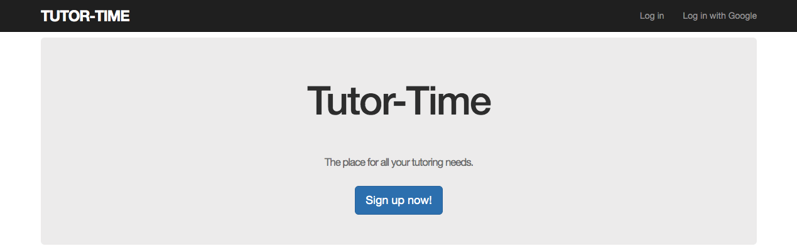

# Tutor-Time

Sinatra framework application that utilizes the CRUD (Create, Read, Update, Delete), MVC (Model-View-Controller format.

The application allows a student to create, view, delete, and update appointments with a tutor based on the subject that is  offered. 

# Installation

1. bundle install
2. rake db:migrate
3. Run $rails s 
4. Open up browser to http://localhost:3000/

# License
The gem is available as open source under the terms of the MIT License.

# Code of Conduct
Everyone interacting in Tutor-Time codebases, issue trackers, chat rooms and mailing lists is expected to follow the code of conduct.

